  

### 一 &nbsp;·&nbsp; who wanders here

**Rimjhim** (রিমঝিম) is the Bengali word for the soft, steady sound of rain. Fitting, for someone who works quietly
and mostly at night.

I'm a final-year Computer Science & Engineering student at Premier University, Chattogram. I take machine-learning
problems end to end, from preprocessing and class-imbalance handling through benchmarking and tuning, and then build
the engineering around them: REST backends, databases, and the n8n workflow automations that keep everything moving
while I sleep. I don't sleep much.

- **Walking the path of** — ML pipelines, applied research, backend systems
- **Currently forging** — n8n automations, CRM integrations, cleaner benchmarks
- **Open to** — internships and research roles, 2026
- **Ask me about** — XGBoost vs. neural nets, webhooks, why the cat looks like that

 

### 二 &nbsp;·&nbsp; the three disciplines

<table>
  <tr>
    <td width="33%" valign="top">
      <b>刀 &nbsp;Machine learning</b>  
      Feature engineering, resampling for class imbalance, stratified k-fold and honest benchmarking across gradient
      boosting and neural networks, with Optuna doing the hyperparameter search.
        
      <code>scikit-learn</code> <code>PyTorch</code> <code>TensorFlow</code> <code>XGBoost</code> <code>Optuna</code>
    </td>
    <td width="33%" valign="top">
      <b>城 &nbsp;Backends &amp; data</b>  
      Layered REST APIs with server-side search, sorting, pagination and authentication over relational schemas,
      wired to React front-ends and shipped through CI.
        
      <code>Spring Boot</code> <code>FastAPI</code> <code>JPA</code> <code>MySQL</code> <code>GitHub Actions</code>
    </td>
    <td width="33%" valign="top">
      <b>雨 &nbsp;Automation</b>  
      n8n workflow automations, CRM and billing workflows, scheduling pipelines and webhook integrations that replace
      manual repetition with scheduled jobs and API calls.
        
      <code>n8n</code> <code>GoHighLevel</code> <code>Webhooks</code> <code>REST</code> <code>Python</code>
    </td>
  </tr>
</table>

### 三 &nbsp;·&nbsp; n8n workflow automations

I build n8n workflows that take repetitive operational work off people's plates. A flow usually starts from a trigger
(an incoming webhook, a form submission or a schedule), reshapes the payload in a Code node, branches on business
rules with If and Switch nodes, and then fans out to the systems that need the result: enriching a record over HTTP,
upserting the contact into a CRM such as GoHighLevel, alerting the team and starting a follow-up sequence. The diagram
above shows that shape as an example rather than a specific client build.

- **Triggers** — webhooks, schedules and app events, validated before anything is written
- **Integrations** — REST APIs through HTTP Request nodes, credentials kept inside n8n
- **Data shaping** — JavaScript Code nodes that normalise names, phones and dates
- **Branching** — If / Switch routing so different records take different paths
- **CRM sync** — create-or-update contacts, tags and pipeline stages without duplicates
- **Reliability** — error workflows, retries on flaky APIs, execution logs that show failures

 

### 四 &nbsp;·&nbsp; selected work

| | Project | Stack |
| :---: | --- | --- |
| 壱 | [**Cerebral Stroke Prediction**](https://github.com/RimjhimD/Cerebral-Stroke-Prediction-using-Machine-Learning) — end-to-end pipeline on clinical data with class-imbalance resampling and stratified benchmarking | Python · scikit-learn · PyTorch · XGBoost · Optuna |
| 弐 | **Skin Cancer Type Detection** — DenseNet, ResNet and a Vision Transformer benchmarked on HAM10000 | Python · CNNs · ViT |
| 参 | [**CRUDCare — Blood Bank Management**](https://github.com/RimjhimD/CRUDCare-Blood-Bank-Management-System-) — donors, stock and requests with role-based access | PHP · MySQL |
| 肆 | [**PayCraft**](https://github.com/RimjhimD/PayCraft) — responsive digital payment interface with a validated form | HTML · CSS · JavaScript |
| 伍 | [**ESP32 Web Server + DHT11**](https://github.com/RimjhimD/ESP-32-Web-Server-with-DHT11-Sensor) — live temperature and humidity served from the chip | C++ · ESP32 |
| 陸 | [**Portfolio**](https://github.com/RimjhimD/PORTFOLIO) — hand-written site with a full animation layer, no framework | HTML · CSS · JavaScript |

  
   
  <a href="https://rimjhimd.github.io/PORTFOLIO/">enter the portfolio →</a>

### 五 &nbsp;·&nbsp; arsenal

  
    
  
    
  
  
  
  

### 六 &nbsp;·&nbsp; the snake eats my commits

<picture>
  <source media="(prefers-color-scheme: dark)" srcset="https://raw.githubusercontent.com/RimjhimD/RimjhimD/output/snake-dark.svg">
  <source media="(prefers-color-scheme: light)" srcset="https://raw.githubusercontent.com/RimjhimD/RimjhimD/output/snake-light.svg">
  
</picture>

### 七 &nbsp;·&nbsp; send a raven

